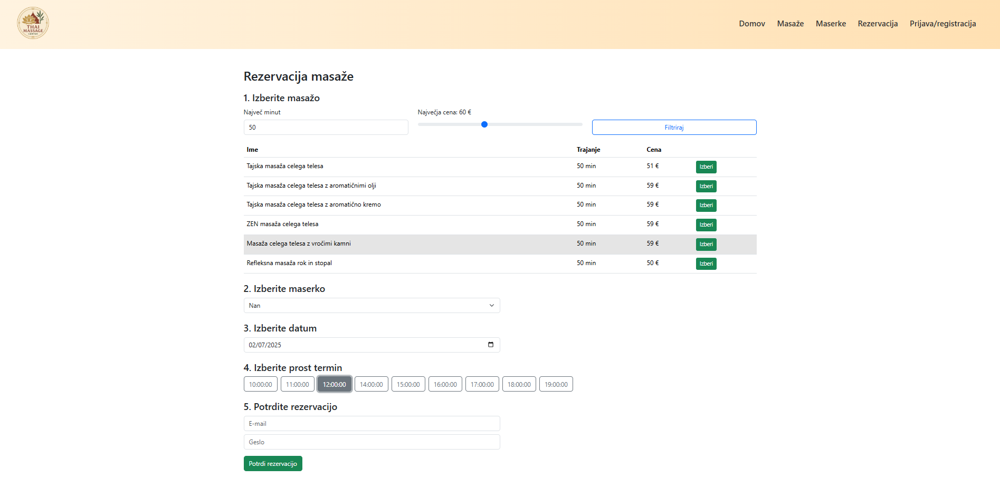
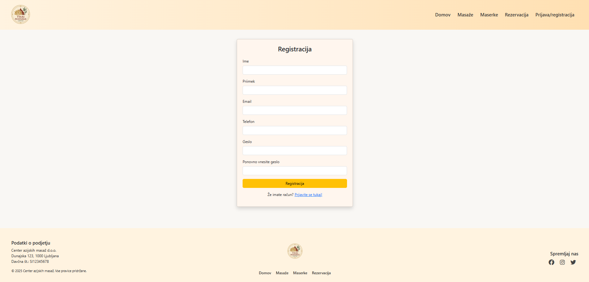
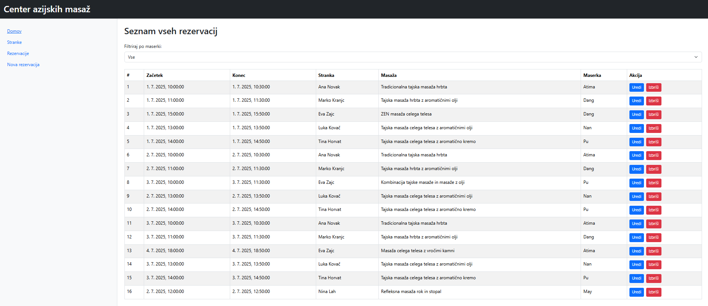

# 🧘‍♀️ Massage Booking Platform

A full-stack web application for managing massage appointments.  
Built to simulate a real-world spa environment, the platform supports both customers and receptionists with tailored interfaces and functionality.

---

## 👥 User Roles

### 👤 **Client / Customer**
- Can view massage services
- Registers and logs in via the website
- Books appointments with selected masseuse and date/time
- Views their reservations
- Can edit or cancel reservations

### 🧑‍💼 **Receptionist**
- Logs in to receptionist interface
- Views all customers (search by name/surname)
- Views all reservations (filterable by masseuse)
- Can add, edit, or delete reservations (e.g., from phone calls or walk-ins)
- Unregistered customers are highlighted in red for follow-up

---

## ✨ Features

- 🔐 User authentication (via localStorage)
- 🧘 Reservation system for clients
- 👥 Receptionist admin panel
- 🔎 Search and filtering (customers, masseuses, reservations)
- 📂 Local persistent storage via H2 file database

---

## ⚙️ Tech Stack

| Layer       | Technologies                          |
|-------------|----------------------------------------|
| **Frontend**| HTML, CSS, Bootstrap, Vue.js (via CDN), Axios |
| **Backend** | Java 17, Spring Boot (Maven), H2 Database |
| **Storage** | `spring.datasource.url=jdbc:h2:file:./data/massages-db` |
| **Session** | Uses `localStorage` for user data (no tokens yet) |

---

## 🖼️ Screenshots

### Landing Page

### Reservation Page (Client)

### Registration

### User Account

### Customer Database (Receptionist)

### Reservation List (Receptionist)

### Add reservation (Receptionist)

