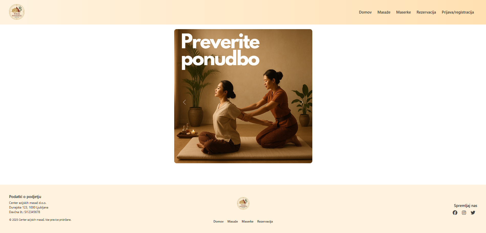
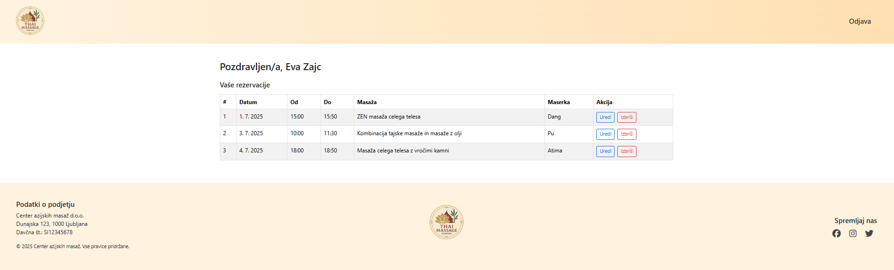
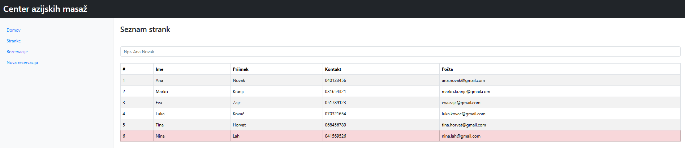
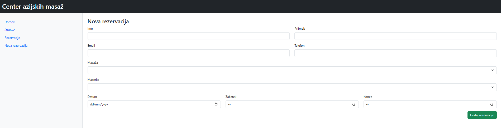

# 🧘‍♀️ Massage Booking Platform

A full-stack web application for managing massage appointments.  
Built to simulate a real-world spa environment, the platform supports both customers and receptionists with tailored interfaces and functionality.

---

## 👥 User Roles

### 👤 **Client / Customer**
- Can view massage services
- Registers and logs in via the website
- Books appointments with selected masseuse and date/time
- Views their reservations
- Can edit or cancel reservations

### 🧑‍💼 **Receptionist**
- Logs in to receptionist interface
- Views all customers (search by name/surname)
- Views all reservations (filterable by masseuse)
- Can add, edit, or delete reservations (e.g., from phone calls or walk-ins)
- Unregistered customers are highlighted in red for follow-up

---

## ✨ Features

- 🔐 User authentication (via localStorage)
- 🧘 Reservation system for clients
- 👥 Receptionist admin panel
- 🔎 Search and filtering (customers, masseuses, reservations)
- 📂 Local persistent storage via H2 file database

---

## ⚙️ Tech Stack

| Layer       | Technologies                          |
|-------------|----------------------------------------|
| **Frontend**| HTML, CSS, Bootstrap, Vue.js (via CDN), Axios |
| **Backend** | Java 17, Spring Boot (Maven), H2 Database |
| **Storage** | `spring.datasource.url=jdbc:h2:file:./data/massages-db` |
| **Session** | Uses `localStorage` for user data (no tokens yet) |

---

## 🖼️ Screenshots

### Landing Page


### Reservation Page (Client)


### Registration


### User Account


### Customer Database (Receptionist)


### Reservation List (Receptionist)


### Add reservation (Receptionist)



## 🚀 Getting Started

### ✅ Prerequisites
- Java 17+
- Maven
- A modern web browser

---

### ▶️ Run the Backend

```bash
cd backend
./mvnw spring-boot:run
```
The backend will start at: http://localhost:8080

### 🌐 Use the Frontend

Just open this file in your browser:

frontend/index.html

### 🗂️ Folder Structure

massage-booking-platform/
├── backend/              # Spring Boot backend
│   └── src/
│       └── main/
│           └── resources/
│               └── application.properties
├── frontend/             # HTML, CSS, Vue.js (static files)
│   ├── index.html
│   ├── massages.html
│   └── js/
├── file/data/            # H2 database file
├── assets/               # Screenshots for the README
├── .gitignore
└── README.md

### 🛣️ Future Improvements

- ✅ Replace localStorage with secure session/token management

- 📧 Add email confirmations for reservations

- 📆 Calendar view for receptionists

- 📱 Make the site responsive for mobile devices

### 📄 License

This project is licensed under the MIT License.

### 👩‍💻 Author

Made with ❤️ by masikag